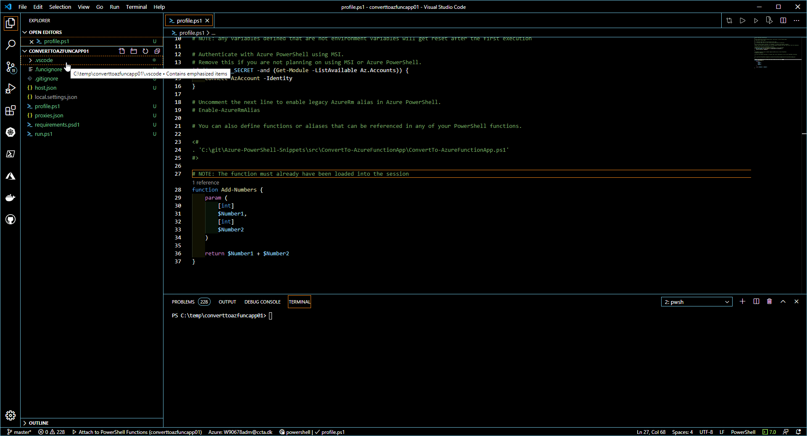

#Convert PS Function to App function

Generates the code needed to execute a PowerShell function in an Azure Function App function.

The code necessary to parse the request query or body is generated, and the function is called using the function parameters.

The PS function must be available to the FA function. Best practice is to import modules and place functions in `profile.ps1`.

For this to work first dot-source `ConvertTo-AzureFunctionApp.ps1`.

You could do this your `$profile`, ex. run `$psEditor.Workspace.OpenFile($profile)`, then add `. <fullpath>\ConvertTo-AzureFunctionApp.ps1`

- Then press `F1` or `ctrl+shift+p` and filter on `Show additional commands`
- Press enter
- Filter on `Convert PS function to Azure Function App function` (start typing and it will remove non-matches)
